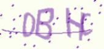
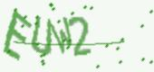

# 基于深度学习的验证码识别

## 环境要求

* python 3.6
* captcha 0.3

## 快速开始

### 1. 生成数据集

在指定的path目录下生成100k张验证码托图片，并划分出20%用作验证集：

```bash
# from Captcha/
python prepare_dataset.py \
	--path=./images \
	--nums=10000
```

生成的数据集的目录结构：

```
|-- Captcha/
	|-- images/
		|-- train/
		|-- test/[ ]()
```





### 2. 转换数据格式

```bash
# from Captcha/
python convert_image_2_h5.py \
	--path=./images/train/ \ 
	--out=./train.h5
python convert_image_2_h5.py \
	--path=./images/test/ \
	--out=./test.h5
```

### 3. 训练

```bash
# from Captcha/
python train.py \
	--train=./train.h5 \
	--test=./test.h5 \
	--epochs=16 \
	--batch_size=256
```

### 4. 测试

```bash
# from Captcha/
python test.pt \
	--input=./test.h5 \
	--model=./log/checkpoint-15-0.8206.hdf5
```

